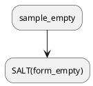

# Feature request: undocumented features & integration test coverage gaps

**Date:** 2026-09-26
**Severity:** medium (features work but are invisible to users; critical paths
lack integration coverage)

## Context

A full-code review of `src/` against `README.md` and `docs/important/features.md`
found (1) features implemented in code but not documented anywhere, and (2)
features with only unit tests (pure-logic checks via bun) but **no CDP
integration test** driving them through a real editor/preview.

This document tracks both gaps so they can be addressed incrementally.

---

## Part A — Features implemented but not in README

### A1. PlantUML `!include` / `!includesub` directive resolution

`src/plantuml/include.ts` — `!include` and `!includesub` directives in puml
fences are resolved relative to the Markdown file's folder, plus configurable
`hackerMarkdown.plantuml.includepaths`. Include loop detection with a
diagnostic error message is built in.

### A2. PlantUML `!pragma sourceFile` auto-injection

`src/plantuml/fences.ts:82` — the extension automatically injects
`!pragma sourceFile <path>` into the diagram source sent to the server, so
the server emits per-SALT-block `data-source-code` ranges. This is what
enables click-to-source on individual SALT mockup elements inside inlined
SVGs.

### A3. Multi-page PlantUML diagrams (`newpage`)

`src/plantuml/diagram.ts:44` — diagrams with `newpage` directives render as
multiple images (one per page). Not mentioned anywhere in docs.

### A4. Diagram type auto-detection (Ditaa → PNG)

`src/plantuml/type.ts` — auto-detects UML / Ditaa / Dot / Gantt / Salt from
`@start...` markers. Ditaa renders as PNG; everything else as SVG.

### A5. Code-server mermaid fallback rendering

`src/plantuml/fences.ts:31` (`PUML_UNWRAPPED_REG`) — special fallback regex
handles the case where the mermaid extension's `highlight` override breaks
`<pre><code>` fence wrapping on code-server.

### A6. Stale block keepers (anti-flicker during re-render)

`src/webview/stale.ts` — during re-renders, old diagrams/images are kept
visible in place while new ones load, preventing white flashes.

### A7. Reading-position anchor guard (pixel-perfect scroll preservation)

`src/webview/anchor.ts` — scroll position is preserved across re-renders. An
anchor guard watches for async diagram rendering layout shifts and
compensates for up to 10 seconds, releasing when the user scrolls manually.

### A8. Pan/zoom state persistence (keyed by content)

`src/webview/frames.ts:50` — pan/zoom state for each diagram survives
re-renders, keyed by content hash (img src / SVG markup). TTL-evicted after
5 seconds if the diagram is removed from the document.

### A9. Alt+click / Ctrl+wheel zoom on diagram frames

`src/webview/frames.ts:209` — Alt+click zooms (Shift+Alt+click zooms out),
Alt+wheel or Ctrl+wheel pinch-zooms, plus a hover toolbar with pan mode
toggle and zoom in / out / reset buttons.

### A10. `renderOnSave` toggle (live vs save-only rendering)

`hackerMarkdown.renderOnSave` setting — when `false`, re-renders live
(debounced 300 ms) as you type; when `true` (default), only on save.

### A11. Custom styles resolution (file://, absolute, https, workspace-relative)

`src/previewHost.ts:418` — `hackerMarkdown.styles` accepts file:// URIs,
absolute paths, https URLs, `/workspace-root` paths, and relative paths
resolved against the Markdown file's folder. All with mtime cache-busting.

### A12. Contributed `markdown.previewScripts` / `previewStyles` loading

`src/previewHost.ts:344` — any extension contributing
`markdown.previewScripts` or `markdown.previewStyles` gets loaded into the
preview. Beyond mermaid/KaTeX this is a general interop mechanism.

### A13. Markdown font setting overrides

`src/previewHost.ts:225` — reads `markdown.preview.fontFamily`,
`fontSize`, `lineHeight` and applies them as CSS custom properties.

### A14. Smart pin release on tab close

`src/previewManager.ts:81` — pin auto-releases when the pinned document's
**last tab** closes (tracked via `onDidChangeTabs`, not the delayed
`onDidCloseTextDocument`). The preview then resumes following the active
editor immediately.

### A15. SALT mockup cursor highlight with SVG `vector-effect`

`src/webview/cursor.ts:86` — SALT mockups inside inlined PlantUML SVGs are
highlighted via injected `<rect>` overlays using
`vector-effect: non-scaling-stroke`, so the highlight stays visually
constant regardless of pan/zoom transforms.

### A16. Graceful degradation on PlantUML server failure

`src/plantuml/inlineSvg.ts:64` + `fences.ts:120` — failed SVG fetches keep
the original `` (diagram still renders as a plain image). No server
configured → an actionable error notice with an *Open Settings* button and
a collapsible source view.

### A17. File picker when no Markdown is open

`src/extension.ts:112` — if no Markdown document is active, the Open
command shows a workspace Quick Pick of `.md` files.

### A18. `retainContextWhenHidden` on both hosts

`src/extension.ts:47` + `previewManager.ts:582` — both the docked view and
editor panel use `retainContextWhenHidden: true`, so the webview state
survives being hidden without re-initializing.

### A19. Mermaid source-span reconstruction

`src/mermaid/fences.ts` — the mermaid markdown-it plugin drops `data-line`
source maps, so the extension rescans the document for ```` ```mermaid ````
fences and `:::mermaid` containers and re-attaches source spans positionally
for cursor sync and click-to-source.

---

## Part B — Integration test coverage gaps

### What IS covered by CDP integration tests

| Feature | Test file |
| --- | --- |
| Initial render (headings, code, table, `data-line`) | `test_preview.ts` |
| Mermaid diagram rendering | `test_preview.ts` |
| Pan/zoom frame wrapping + interactions (zoom / pan / reset) | `test_preview.ts` |
| Cursor sync (exact line, containing-block fallback, code fence) | `test_preview.ts` |
| Click-to-source (basic + mermaid) | `test_preview.ts` |
| Scroll sync (path exercised; no DOM assert) | `test_preview.ts` |
| Zoom controls + Ctrl+0 keyboard shortcut | `zoom-reset.spec.ts` |
| Stale-block anti-flicker (mermaid regression) | `mermaid_stale_check.ts` |
| PlantUML syntax highlighting (editor tokens) | `plantuml_note_highlight_check.ts` |

### What is NOT covered (feature → unit test? → requested integration test)

#### B1. PlantUML diagram rendering (server → SVG → inline)

- **Feature:** `src/plantuml/fences.ts`, `src/plantuml/inlineSvg.ts`,
  `src/plantuml/diagram.ts`
- **Unit test:** `tests/units/plantuml_check.ts` (fence rewrite, escaping,
  `!include`, SALT scan), `tests/units/plantuml_inline_check.ts` (SVG
  inlining with stub fetcher)
- **Integration gap:** No CDP test verifies that a puml fence actually
  renders as an `<svg>` / `` in the live preview, that `data-hmk-from`
  / `data-hmk-to` source spans are attached, or that the PlantUML server
  URL is correctly encoded.
- **Suggested test:** `plantuml_render_check.ts` — open a `.md` with a puml
  fence, assert `<svg data-hmk-puml>` (or ``) appears in
  `#preview`, assert `data-hmk-from` / `data-hmk-to` match the fence's
  source lines.

#### B2. PlantUML language features (7 providers)

- **Features:** go-to-definition, find-references, hover, rename, document
  highlights, code lens, folding
  (`src/completions/definitions.ts`)
- **Unit test:** `tests/units/plantuml_definition_check.ts`
- **Integration gap:** None of the 7 providers are driven through a real
  Monaco editor. They could silently break if fence detection, position
  mapping, or the VS Code provider contract changes.
- **Suggested tests:**
  - `plantuml_definition_ix.ts` — position cursor on `SALT(alias)`, execute
    `editor.action.revealDefinition`, assert it jumps to the
    `!procedure _alias()` line.
  - `plantuml_references_ix.ts` — execute `editor.action.referenceSearch`
    on the same alias, assert N locations.
  - `plantuml_hover_ix.ts` — hover over the alias, assert the hover popup
    contains the procedure signature and reference count.
  - `plantuml_rename_ix.ts` — F2 on the alias, type new name, assert all
    `SALT(old)` became `SALT(new)` and `!procedure _old` became
    `!procedure _new`.
  - `plantuml_codelens_ix.ts` — assert "N references" code lens appears
    above each `!procedure` definition.
  - `plantuml_folding_ix.ts` — assert `!procedure ... !endprocedure` is
    foldable.

#### B3. PlantUML code completion

- **Feature:** `src/completions/provider.ts`
- **Unit test:** `tests/units/plantuml_completion_check.ts`
- **Integration gap:** No CDP test verifies that typing `@start` or `!inc`
  inside a puml fence triggers the completion popup with the right items.
- **Suggested test:** `plantuml_completion_ix.ts` — position cursor inside
  a puml fence, type `@startum`, trigger completion, assert
  `@startuml` is in the suggestion list.

#### B4. Pin / lock + auto-release on tab close

- **Feature:** `src/previewManager.ts:170` (`togglePin`),
  `:81` (`onDidChangeTabs` auto-release)
- **Unit test:** none
- **Integration gap:** Pin lifecycle is completely untested. The
  auto-release-when-last-tab-closes path is subtle and fragile.
- **Suggested test:** `pin_lifecycle_ix.ts` — click the pin button, switch
  to a different `.md`, assert the preview doc-name does NOT change. Then
  close the pinned document's last tab, assert the preview resumes
  following the active editor.

#### B5. Media toolbar dropdowns (invert / tables / column width)

- **Feature:** `src/webview/menus.ts`, `src/previewHost.ts:277`
- **Unit test:** none
- **Integration gap:** Only zoom is tested
  (`zoom-reset.spec.ts`). Invert, tables pan/fit, and column width have
  zero coverage.
- **Suggested tests:**
  - `media_invert_ix.ts` — open the invert dropdown, select `dark`, assert
    `body[data-invert="dark"]` and the `hackerMarkdown.media.invert`
    setting persisted.
  - `media_tables_ix.ts` — open the tables dropdown, select `fit`, assert
    `body[data-tables="fit"]`.
  - `media_column_ix.ts` — type `700px` in the column-width input, assert
    `--hmk-column-width: 700px`; press Escape, assert it reverts.

#### B6. Link navigation (internal / external / `#fragment`)

- **Feature:** `src/previewManager.ts:442` (`openLink`),
  `src/webview/main.ts:180` (fragment scroll)
- **Unit test:** none
- **Integration gap:** Link clicks are completely untested via CDP.
  Different link types (`./other.md`, `https://…`, `#heading`) take
  different code paths.
- **Suggested test:** `link_nav_ix.ts` — click a relative `.md` link,
  assert the editor opens that file and the preview re-targets. Click a
  `#fragment` link, assert the preview scrolls to the heading. (External
  links are hard to assert — skip or mock.)

#### B7. Live update / `renderOnSave` toggle

- **Feature:** `src/previewManager.ts:56` (`onDidChangeTextDocument` vs
  `onDidSaveTextDocument`)
- **Unit test:** none
- **Integration gap:** No test verifies that typing a change (without
  saving) does or does not update the preview depending on the
  `renderOnSave` setting.
- **Suggested test:** `render_on_save_ix.ts` — with `renderOnSave: false`,
  type a character in the editor, assert the preview updates within ~1s.
  With `renderOnSave: true`, type, assert preview does NOT update until
  save.

#### B8. Editor-area preview (`openInEditor`) + serialize/deserialize

- **Feature:** `src/previewManager.ts:571` (`openInEditor`),
  `:607` (`deserializeWebviewPanel`)
- **Unit test:** none
- **Integration gap:** The editor-area preview and its window-reload
  survival path are untested.
- **Suggested test:** `editor_preview_ix.ts` — run `hackerMarkdown.openInEditor`,
  assert a second preview appears in the editor area rendering the same
  document. Optionally: reload the window, assert the editor panel
  re-opens to the same document (requires `retainContextWhenHidden` +
  serialized state).

#### B9. Custom styles (`hackerMarkdown.styles` / `markdown.styles`)

- **Feature:** `src/previewHost.ts:317`
- **Unit test:** none
- **Integration gap:** No test verifies that a user CSS file is loaded and
  applied, or that mtime cache-busting works.
- **Suggested test:** `custom_styles_ix.ts` — set
  `hackerMarkdown.styles` to a test CSS file, assert a `<link>` with the
  expected href appears in the webview `<head>`.

#### B10. SALT mockup cursor highlight + click-to-source

- **Feature:** `src/webview/cursor.ts:86`, `src/webview/source.ts:39`,
  `src/webview/source-code.ts`
- **Unit test:** `tests/units/plantuml_check.ts` (SALT scan logic)
- **Integration gap:** The SVG `<rect>` overlay injection for SALT mockups
  and the exact-range click-to-source for `data-source-code` elements have
  no CDP test.
- **Suggested test:** `plantuml_salt_cursor_ix.ts` — requires a running
  PlantUML server. Open a `.md` with a SALT activity diagram, move cursor
  to the `SALT(alias)` invocation line, assert `[data-hmk-salt-cursor]`
  `<rect>` overlays appear in the inlined SVG. Click the mockup, assert
  the editor selects the exact source range.

#### B11. Reading-position anchor guard

- **Feature:** `src/webview/anchor.ts`
- **Unit test:** none
- **Integration gap:** The anti-jump behavior (scroll position stays put
  across a re-render that grows layout from async diagrams) is untested.
- **Suggested test:** `anchor_guard_ix.ts` — scroll the preview to a known
  line, trigger a re-render (edit + save), assert the scroll position is
  within a few pixels of where it was. This is inherently racy; assert
  with a generous tolerance or poll until stable.

#### B12. Empty state / file picker Quick Pick

- **Feature:** `src/extension.ts:95`
- **Unit test:** none
- **Integration gap:** The fallback behavior when no `.md` is open is
  untested.
- **Suggested test:** `empty_state_ix.ts` — close all editors, run
  `hackerMarkdown.open`, assert the Quick Pick appears with `.md` files
  from the workspace.

---

## Priority ordering

| Priority | Item | Rationale |
| --- | --- | --- |
| P0 | B2 (language features) | 7 providers, 0 integration tests — highest risk of silent breakage |
| P0 | B4 (pin lifecycle) | Complex tab-tracking logic, no unit or integration test |
| P1 | B1 (puml render) | Core feature; unit tests cover logic but not the live DOM |
| P1 | B5 (media dropdowns) | Only zoom is tested; 3 other controls are untested |
| P1 | B7 (renderOnSave) | Two completely different render paths, untested |
| P2 | B10 (SALT cursor/click) | Deep PlantUML integration; needs running server |
| P2 | B6 (link nav) | Multiple code paths, user-facing |
| P2 | B8 (editor preview + serializer) | Reload survival is fragile |
| P2 | B3 (completion) | Unit test is solid; integration is lower risk |
| P3 | B9 (custom styles) | Low risk, well-isolated |
| P3 | B11 (anchor guard) | Inherently racy; hard to make deterministic |
| P3 | B12 (empty state) | Low complexity |
| P3 | Part A docs | Documentation-only; no code risk |

---

## Fixture gap

Most of the PlantUML integration tests (B1, B2, B3, B10) need a Markdown
fixture with puml fences containing `!procedure`, `SALT(...)` invocations,
and `!include` directives. The existing `tests/samples/workspace/test.md`
does not appear to have puml fences with procedures. A dedicated fixture
(e.g. `tests/samples/plantuml-procedures.md`) should be created with
content like:



Additionally, B1 and B10 require a running PlantUML server
(`hackerMarkdown.plantuml.server` default `http://localhost:9274`). The test
harness should either start the server or `SKIP` gracefully when it's not
reachable.
