## 1. New Enrollment

### 1.1 Start (empty form)

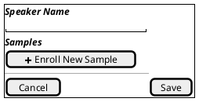

### 1.2 Click "Enroll New Sample"

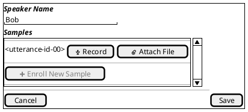

### 1.3 Click "Record"

#### 1.3.1 Recording in progress

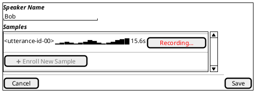

> **Note:** "Enroll New Sample" is disabled while recording is in progress. Only one sample row can record at a time.

#### 1.3.2 Recording error

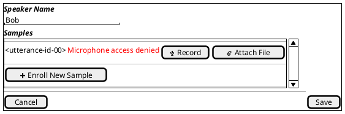

### 1.4 Click "Attach File"

#### 1.4.1 File Attached

This is kinda no-op since the actual upload only starts when the user click

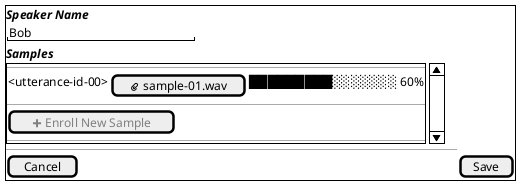

#### 1.4.3 Uploading is Done

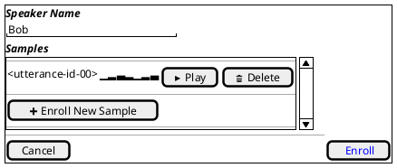

> **Note:** On success the row transitions to the done state (waveform thumbnail, [Play], [Delete]) — identical to the done state after recording.

### 1.5 Done

#### 1.5.1 Single Done

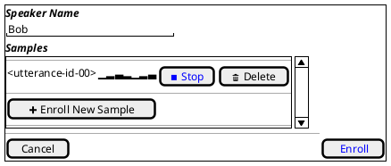

> **Note:** Playback is exclusive — starting play on a second utterance automatically stops the first. Clicking Play while playing toggles to Stop.

#### 1.5.2 Multiple Done

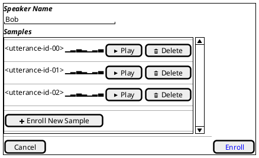

### 1.6 Saving & Enrollment Extraction (API calls in progress)

After all audio files are recorded / attached

#### Start Extracting

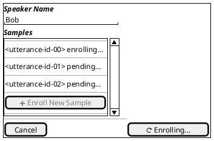

#### Partially Extracted Enrollments

#### All Enrollments are extraced

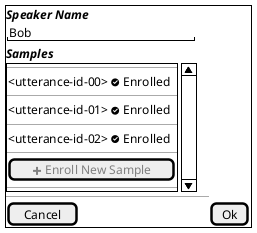

## 2. View Enrollment

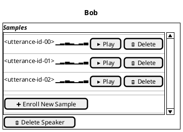
