# Enroll (proposed redesign) — Activity Diagram (happy path: multi-sample enrollment)

```plantuml
@startuml

!unquoted procedure SALT($x)
"{{salt
%invoke_procedure("_"+$x)
}}" as $x
!endprocedure

' ── Start — empty form ──
!procedure _form_empty()
{+
  ====<b>Speaker Name
  "                      "
  ====<b>Samples
  [<&plus> Enroll New Sample]
  ---
  [ Cancel ] | [<color:gray> Enroll ]
}
!endprocedure

' ── Name typed, empty sample row added ──
!procedure _sample_row_empty()
{+
  ====<b>Speaker Name
  "Bob                    "
  ====<b>Samples
  {SI
  ---
  { utterance-id-00 | [<&microphone> Record] | [<&paperclip> Attach File] }
  ---
  [<&plus> Enroll New Sample]
  ---
  }
  ---
  [ Cancel ] | [<color:blue> Enroll ]
}
!endprocedure

' ── Recording in progress ──
!procedure _sample_recording()
{+
  ====<b>Speaker Name
  "Bob                    "
  ====<b>Samples
  {SI
  ---
  { utterance-id-00 | ▁▂▃▂▁▂▃▅▄▂▁▂▃▅▆▇▅▄▂▁▂▃▅▆▇ 15.6s | [<color:red><&stop>Recording...] }
  ---
  [<color:gray><&plus> Enroll New Sample]
  ---
  }
  ---
  [ Cancel ] | [<color:gray> Enroll ]
}
!endprocedure

' ── Mic permission denied — inline error, row returns to Record/Attach ──
!procedure _recording_error()
{+
  ====<b>Speaker Name
  "Bob                    "
  ====<b>Samples
  {SI
  ---
  { utterance-id-00 | <color:red>Microphone access denied | [<&microphone> Record] | [<&paperclip> Attach File] }
  ---
  [<&plus> Enroll New Sample]
  ---
  }
  ---
  [ Cancel ] | [<color:blue> Enroll ]
}
!endprocedure

' ── File attached — client-side only, row transitions to done immediately ──
!procedure _file_attached()
{+
  ====<b>Speaker Name
  "Bob                    "
  ====<b>Samples
  {SI
  ---
  { utterance-id-00 | [<&paperclip> sample-01.wav] | [<&media-play> Play] | [<&trash> Remove] }
  ---
  [<&plus> Enroll New Sample]
  ---
  }
  ---
  [ Cancel ] | [<color:blue> Enroll ]
}
!endprocedure

' ── Recording done, sample completed (not playing) ──
!procedure _sample_done()
{+
  ====<b>Speaker Name
  "Bob                    "
  ====<b>Samples
  {SI
  ---
  { utterance-id-00 | ▁▂▃▂▁▂▃▅▄▂▁▂▃▅▆▇ | [<&media-play> Play] | [<&trash> Remove] }
  ---
  [<&plus> Enroll New Sample]
  ---
  }
  ---
  [ Cancel ] | [<color:blue> Enroll ]
}
!endprocedure

' ── Playing — Play button toggled to Stop; shared UI for recorded & attached (waveform) ──
!procedure _sample_done_clicked_play()
{+
  ====<b>Speaker Name
  "Bob                    "
  ====<b>Samples
  {SI
  ---
  { utterance-id-00 | ▁▂▃▂▁▂▃▅▄▂▁▂▃▅▆▇ | [<color:blue><&media-stop> Stop] | [<&trash> Remove] }
  ---
  [<&plus> Enroll New Sample]
  ---
  }
  ---
  [ Cancel ] | [<color:blue> Enroll ]
}
!endprocedure

' ── Multiple samples done ──
!procedure _multi_done()
{+
  ====<b>Speaker Name
  "Bob                    "
  ====<b>Samples
  {SI
  ---
  {utterance-id-00| ▁▂▃▂▁▂▃▅▄▂▁▂▃▅▆▇ | [<&media-play> Play] | [<&trash> Remove] }
  ---
  {utterance-id-01| ▁▂▃▂▁▂▃▅▄▂▁▂▃▅▆▇ | [<&media-play> Play] | [<&trash> Remove] }
  ---
  [<&plus> Enroll New Sample]
  ---
  }
  ---
  [ Cancel ] | [<color:blue> Enroll ]
}
!endprocedure

' ── Enrolling — utt-0 uploading (utt-1 queued) ──
!procedure _enroll_uploading_0()
{+
  ====<b>Speaker Name
  "Bob                    "
  ====<b>Samples
  {SI
  ---
  { utterance-id-00 | 1/2 Uploading █████░░░░░░░░░░░░ 30% | [ <&ban> Cancel] }
  ---
  { utterance-id-01 | Queued }
  ---
  [<color:gray><&plus> Enroll New Sample]
  ---
  }
  ---
  [ Cancel ] | [<&reload> Enrolling... ]
}
!endprocedure

' ── Enrolling — utt-0 extracting (utt-1 queued) ──
!procedure _enroll_extracting_0()
{+
  ====<b>Speaker Name
  "Bob                    "
  ====<b>Samples
  {SI
  ---
  { utterance-id-00 | 1/2 Extracting ███████████████░░ 90% | [ <&ban> Cancel] }
  ---
  { utterance-id-01 | Queued }
  ---
  [<color:gray><&plus> Enroll New Sample]
  ---
  }
  ---
  [ Cancel ] | [<&reload> Enrolling... ]
}
!endprocedure

' ── Enrolling — utt-0 Enrolled (utt-1 queued) ──
!procedure _enroll_done_0()
{+
  ====<b>Speaker Name
  "Bob                    "
  ====<b>Samples
  {SI
  ---
  { utterance-id-00 | ▁▂▃▂▁▂▃▅▄▂▁▂▃▅▆▇ | <&circle-check> Enrolled | [<&media-play> Play] | [<&trash> Remove]}
  ---
  { utterance-id-01 | Queued }
  ---
  [<color:gray><&plus> Enroll New Sample]
  ---
  }
  ---
  [ Cancel ] | [<&reload> Enrolling... ]
}
!endprocedure

' ── Enrolling — utt-1 uploading (utt-0 Enrolled) ──
!procedure _enroll_uploading_1()
{+
  ====<b>Speaker Name
  "Bob                    "
  ====<b>Samples
  {SI
  ---
  { utterance-id-00 | ▁▂▃▂▁▂▃▅▄▂▁▂▃▅▆▇ | <&circle-check> Enrolled | [<&media-play> Play] | [<&trash> Remove]}
  ---
  { utterance-id-01 | 2/2 Uploading █████░░░░░░░░░░░░ 30% | [ <&ban> Cancel] }
  ---
  [<color:gray><&plus> Enroll New Sample]
  ---
  }
  ---
  [ Cancel ] | [<&reload> Enrolling... ]
}
!endprocedure

' ── Enrolling — utt-1 extracting (utt-0 Enrolled) ──
!procedure _enroll_extracting_1()
{+
  ====<b>Speaker Name
  "Bob                    "
  ====<b>Samples
  {SI
  ---
  { utterance-id-00 | ▁▂▃▂▁▂▃▅▄▂▁▂▃▅▆▇ | <&circle-check> Enrolled | [<&media-play> Play] | [<&trash> Remove]}
  ---
  { utterance-id-01 | 2/2 Extracting ███████████████░░ 90% | [ <&ban> Cancel] }
  ---
  [<color:gray><&plus> Enroll New Sample]
  ---
  }
  ---
  [ Cancel ] | [<&reload> Enrolling... ]
}
!endprocedure

' ── Enrolling — all done, footer becomes Ok ──
!procedure _enroll_done_all()
{+
  ====<b>Speaker Name
  "Bob                    "
  ====<b>Samples
  {SI
  ---
  { utterance-id-00 | ▁▂▃▂▁▂▃▅▄▂▁▂▃▅▆▇ | <&circle-check> Enrolled | [<&media-play> Play] | [<&trash> Remove]}
  ---
  { utterance-id-01 | ▁▂▃▂▁▂▃▅▄▂▁▂▃▅▆▇ | <&circle-check> Enrolled | [<&media-play> Play] | [<&trash> Remove]}
  ---
  [<color:gray><&plus> Enroll New Sample]
  ---
  }
  ---
  [ Cancel ] | [ Ok ]
}
!endprocedure

' ── Saved — notification on dashboard ──
!procedure _saved()
{+
  <b>Dashboard
  ==
  {^" <color:green><&check> |
    <b>Bob enrolled with 3 samples
  }
  ..
  [<b>Go to Speaker Detail]
}
!endprocedure

' ── View previously enrolled speaker (section 2) ──
!procedure _view_speaker()
title Bob
{+
  ====<b>Samples
  {SI
  ---
  {utterance-id-00| ▁▂▃▂▁▂▃▅▄▂▁▂▃▅▆▇ | <&circle-check> Enrolled | [<&media-play> Play] | [<&trash> Remove] }
  ---
  {utterance-id-01| ▁▂▃▂▁▂▃▅▄▂▁▂▃▅▆▇ | <&circle-check> Enrolled | [<&media-play> Play] | [<&trash> Remove] }
  ---
  [<&plus> Enroll New Sample]
  ---
  }
  [<&trash> Remove Speaker]
}
!endprocedure

' ═══════════════════════════════════════════════
' Activity diagram — happy path
' ═══════════════════════════════════════════════

(*) --> SALT(form_empty)

form_empty --> SALT(sample_row_empty)
note on link
  {{salt
  {+
  Type name "Bob";
  click [Enroll New Sample]
  }
  }}
end note

sample_row_empty --> SALT(sample_recording)
note on link
  {{salt
  {+
  Click [Record] on the sample row;
  waveform animates with elapsed time.
  [Enroll New Sample] disabled while recording.
  }
  }}
end note

sample_recording --> SALT(recording_error)
note on link
  {{salt
  {+
  Mic permission denied →
  inline red error on the row;
  row returns to [Record] / [Attach File].
  }
  }}
end note

recording_error --> SALT(sample_recording)
note on link
  {{salt
  {+
  Click [Record] again to retry
  }
  }}
end note

sample_recording --> SALT(sample_done)
note on link
  {{salt
  {+
  Click [Recording...] (stop icon) — recording ends;
  sample row shows waveform thumbnail,
  [Play] / [Stop] toggle and [Remove] buttons.
  No preview/confirm step.
  }
  }}
end note

sample_done --> SALT(sample_done_clicked_play)
note on link
  {{salt
  {+
  Click [Play] — playback starts;
  button toggles to [Stop].
  }
  }}
end note

sample_done_clicked_play --> SALT(sample_done)
note on link
  {{salt
  {+
  Click [Stop] — playback stops;
  button toggles back to [Play].
  }
  }}
end note

sample_row_empty --> SALT(file_attached)
note on link
  {{salt
  {+
  Click [Attach File] — client-side only;
  audio stays on the client, nothing uploaded yet.
  Row transitions to done immediately
  (file label, [Play], [Remove]).
  }
  }}
end note

file_attached --> SALT(sample_done_clicked_play)
note on link
  {{salt
  {+
  Click [Play] — playback starts;
  button toggles to [Stop].
  }
  }}
end note

sample_done_clicked_play --> SALT(file_attached)
note on link
  {{salt
  {+
  Click [Stop] — playback stops;
  button toggles back to [Play].
  }
  }}
end note

file_attached --> SALT(multi_done)
note on link
  {{salt
  {+
  [Enroll New Sample] × 2 more times;
  record or attach 2 more utterances
  }
  }}
end note

sample_done --> SALT(multi_done)
note on link
  {{salt
  {+
  [Enroll New Sample] × 2 more times;
  record 2 more utterances
  }
  }}
end note

multi_done --> SALT(enroll_uploading_0)
note on link
  {{salt
  {+
  [Enroll] — all audio files uploaded and
  enrolled one by one in order:
  utt-0 uploading 30% (1/2),
  utt-1 Queued.
  Per-row [Cancel]; footer [Enrolling...].
  }
  }}
end note

enroll_uploading_0 --> SALT(enroll_extracting_0)
note on link
  {{salt
  {+
  utt-0 extracting 90% (1/2),
  utt-1 still Queued
  }
  }}
end note

enroll_extracting_0 --> SALT(enroll_done_0)
note on link
  {{salt
  {+
  utt-0 → Enrolled (✓, [Play], [Remove]);
  utt-1 still Queued
  }
  }}
end note

enroll_done_0 --> SALT(enroll_uploading_1)
note on link
  {{salt
  {+
  utt-1 uploading 30% (2/2) via
  POST /v1/asv/file/register
  }
  }}
end note

enroll_uploading_1 --> SALT(enroll_extracting_1)
note on link
  {{salt
  {+
  utt-1 extracting 90% (2/2)
  }
  }}
end note

enroll_extracting_1 --> SALT(enroll_done_all)
note on link
  {{salt
  {+
  utt-1 → Enrolled;
  footer becomes [Ok]
  }
  }}
end note

enroll_done_all --> SALT(saved)
note on link
  {{salt
  {+
  All samples saved;
  redirected to Dashboard with notification
  "Bob enrolled with 3 samples"
  }
  }}
end note

saved --> SALT(view_speaker)
note on link
  {{salt
  {+
  [Go to Speaker Detail] — view previously
  enrolled speaker: Enrolled rows,
  [Enroll New Sample], [Remove Speaker]
  }
  }}
end note

view_speaker --> (*)

@enduml
```

> **Key UX details implemented:**
>
> | Behavior | Detail |
> |---|---|
> | Play/Stop toggle | Play icon → Stop icon while playing; click again to stop |
> | Audio exclusivity | Playing a second utterance auto-stops the first |
> | Cleanup on unmount | Navigating away or deleting a row stops audio |
> | Attach file instant | File selection → row transitions to done immediately; client-side only, nothing uploaded until [Enroll] |
> | Mic error | Mic denied → inline error on row; returns to [Record] / [Attach File] for retry |
> | Recording lock | Only one row can record at a time; [Enroll New Sample] disabled |
> | Sequential enroll | [Enroll] processes samples one by one (uploading → extracting → Enrolled); unprocessed rows show Queued |
> | Cancel during enroll | Per-row [Cancel] aborts the current sample; footer shows [Enrolling...] spinner until the last sample, then [Ok] |
> | Batch notification | All samples enrolled → notification "Bob enrolled with 3 samples" → redirect |
