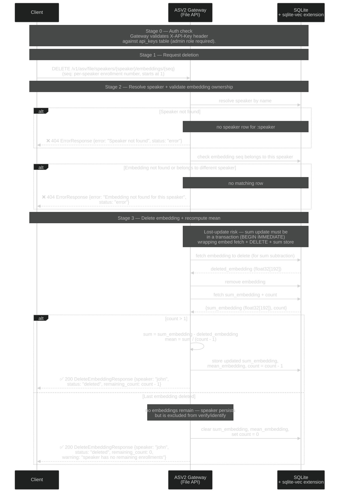

```mermaid
%%{init: {'theme': 'dark'}}%%
%% ASV Gateway — Delete Enrollment v2026.07.28.001
%% Model: Removes a single enrollment embedding for a speaker, then recomputes
%%        the cached mean embedding. If the last embedding is deleted, the
%%        speaker persists but mean_embedding is cleared and the speaker
%%        is excluded from verify/identify results until re-enrolled.
%%
%% Multi-enrollment design: docs/important/apis/v1/asv/AsvFile._README.md
%% Auth model: docs/important/apis/v1/asv/AsvFile._README.md#security
%%
%% All request/response schemas are defined in:
%%   - asv/file.openapi.yaml (gateway: DELETE /v1/asv/file/speakers/{speaker}/embeddings/{seq})
%% Inline field annotations are contextual hints only — the OpenAPI specs are authoritative.
sequenceDiagram
    participant C as Client
    participant G as ASV2 Gateway<br/>(File API)
    participant D as SQLite<br/>+ sqlite-vec extension

    Note over C,D: Stage 0 — Auth check<br/>Gateway validates X-API-Key header<br/>against api_keys table (admin role required).

    Note over C,D: Stage 1 — Request deletion

        C->>G: DELETE /v1/asv/file/speakers/{speaker}/embeddings/{seq}<br/>(seq: per-speaker enrollment number, starts at 1)

    Note over C,D: Stage 2 — Resolve speaker + validate embedding ownership

        G->>D: resolve speaker by name

        alt Speaker not found
            Note over G,D: no speaker row for :speaker
            G-->>C: ❌ 404 ErrorResponse {error: "Speaker not found", status: "error"}
        end

        G->>D: check embedding seq belongs to this speaker

        alt Embedding not found or belongs to different speaker
            Note over G,D: no matching row
            G-->>C: ❌ 404 ErrorResponse {error: "Embedding not found for this speaker",<br/>status: "error"}
        end

    Note over C,D: Stage 3 — Delete embedding + recompute mean

        Note over G,D: Lost-update risk — sum update must be<br/>in a transaction (BEGIN IMMEDIATE)<br/>wrapping embed fetch + DELETE + sum store
        G->>D: fetch embedding to delete (for sum subtraction)
        D-->>G: deleted_embedding (float32[192])

        G->>D: remove embedding

        G->>D: fetch sum_embedding + count
        D-->>G: {sum_embedding (float32[192]), count}

        alt count > 1
            G->>G: sum = sum_embedding - deleted_embedding<br/>mean = sum / (count - 1)
            G->>D: store updated sum_embedding,<br/>mean_embedding, count = count - 1
            G-->>C: ✅ 200 DeleteEmbeddingResponse {speaker: "john",<br/>status: "deleted", remaining_count: count - 1}
        else Last embedding deleted
            Note over G: no embeddings remain — speaker persists<br/>but is excluded from verify/identify
            G->>D: clear sum_embedding, mean_embedding,<br/>set count = 0
            G-->>C: ✅ 200 DeleteEmbeddingResponse {speaker: "john",<br/>status: "deleted", remaining_count: 0,<br/>warning: "speaker has no remaining enrollments"}
        end
```
