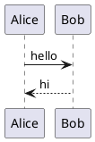
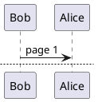
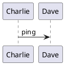

# PlantUML Render Check

## Simple diagram

```plantuml
@startuml
Alice -> Bob: hello
Bob --> Alice: hi
@enduml
```

## Multi-page diagram

```plantuml
@startuml
Bob -> Alice : page 1
newpage
Bob <- Alice : page 2
@enduml
```

## puml fence alias

```puml
@startuml
Charlie -> Dave: ping
@enduml
```
