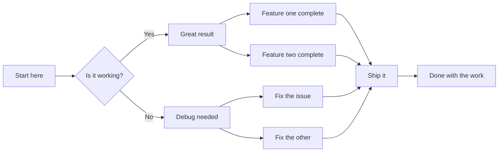

# E2E anchor test

## Mermaid diagram

## Reading note

This is the reading position. The user reads this note right below the
diagram; when the diagram re-renders and grows, this line must not move.

Filler paragraph three. More scrolling room so the viewport can be
positioned with the diagram near the top edge and the note in view.

Filler paragraph four. Still more room, because a short document would
clamp the scroll position and defeat the test.
