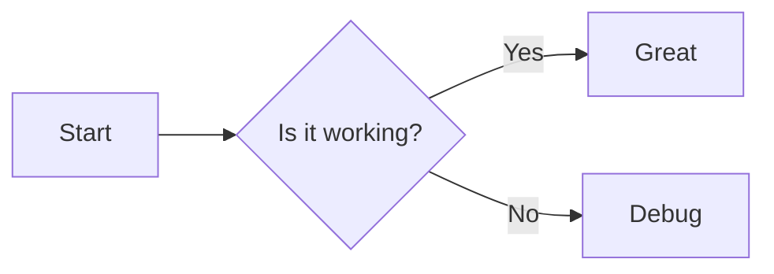
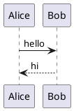

# Hacker Markdown Preview Test

This file exercises the features of the docked markdown preview.

## Headings

### Level three heading

## Code blocks

```python
def greet(name: str) -> str:
    return f"Hello, {name}!"
```

```ts
const x: number = 42;
console.log(x);
```

## Lists

- one
- two
- three

1. first
2. second

## Links

[VS Code](https://code.visualstudio.com)

[Another markdown file](./sub.md)

## Images


## Blockquote

> quoted text

## Table

| a | b |
|---|---|
| 1 | 2 |

## Math-ish inline

Inline `code` and **bold** and *italic*.

- [ ] todo item

## Mermaid



## PlantUML


